Shadowbook is a single-instrument limit order book matching engine in Rust, checked against an independent reference engine by differential fuzzing: every command is applied to both, and the two must agree on the resulting event stream, not just the resulting book.

<div align="center">
  
</div>

Matching engines are a solved exercise. Price-time priority is a page of pseudocode, and
you can find a hundred implementations of it on GitHub before lunch. None of them can tell
you whether they are correct.

Shadowbook is not an attempt to write a fast order book. It is an attempt to write one
whose correctness is *demonstrable*: an optimized engine, a deliberately naive reference
implementation, and a differential fuzzer that has driven 100,000,000 commands through
both and found no state at which they disagree.

<div align="center">
  
</div>

| crate        | job                                                                          |
| ------------ | ---------------------------------------------------------------------------- |
| `types/`     | Commands and events. The only thing both implementations agree on up front.  |
| `reference/` | The oracle. `Vec`, linear scan, no cleverness. Written to be read, not run.  |
| `engine/`    | The real one. Order arena, 65,536-tick price band, zero hot-path allocation. |
| `fuzz/`      | The differential harness plus the auditor that compares emitted events.      |
| `benches/`   | Criterion, harness disabled, manual timing.                                  |

<div align="center">
  
</div>

Every command goes to both. Every event stream gets compared. Any divergence is a bug in
exactly one of them, and the reference is the one that is obviously right.

```
$ cargo run --release -p fuzz --bin seeded_runner -- 42 100000000

  seed        42
  ops         100,000,000
  elapsed     314.8s
  throughput  317,642 ops/sec
  divergences 0
```

The logical result is seed-reproducible: replaying the same 100,000,000-command log into
fresh instances of both engines matched byte for byte, checked in 20.5s. The wall clock
above is not reproducible in the same sense — it moves with the machine and its load — so
treat 314.8s as this run's number, not a promised figure. Both numbers are in
[`FINDINGS.md`](FINDINGS.md).

<div align="center">
  
</div>

> [!NOTE]
> Crossing inserts are not covered by this number. They do matching work and they are
> slower. There is no throughput benchmark in this repo, and the reciprocal of a latency
> figure is not one. Full methodology and the raw distribution are in [`BENCH.md`](BENCH.md).

<div align="center">
  
</div>

Once the engine stabilized, the bugs stopped being in the engine. They moved into the
verification machinery: the generator, the auditor, the shrinker. The thing I built to
find bugs became the thing with the bugs in it.

And there is a class of bug it structurally cannot see. If `reference/` and `engine/`
share an assumption, they share the bug, they emit identical wrong events, and the
auditor reports agreement. Order-id reuse was exactly this. No amount of fuzzing finds
it, because 100,000,000 green runs and 100,000,000 correct runs are not the same claim.

Zero divergences means zero *disagreement*. It has never meant zero bugs.

[`FINDINGS.md`](FINDINGS.md) · [`ERRATA.md`](ERRATA.md)

## Layout

```
shadowbook/
├── types/          commands, events, ids
├── reference/      the oracle
├── engine/         the optimized book
│   ├── arena.rs    65,536-order slab
│   └── levels.rs   65,536-tick price band, bitmap-summarized
├── fuzz/           differential harness + auditor
├── benches/        criterion, harness disabled
├── FINDINGS.md     what the fuzzer found, including its own bugs
├── BENCH.md        methodology and raw distributions
└── ERRATA.md       claims I corrected after making them
```

## Running

```sh
cargo test --workspace                                          # unit + reference conformance
cargo run --release -p fuzz --bin seeded_runner -- 42 1000000   # differential, short
cargo run --release -p fuzz --bin seeded_runner -- 42 100000000 # differential, the full run
cargo bench -p benches                                          # criterion
```

The last command reproduces any run described in FINDINGS.md from its seed. A divergence, if one is ever found, prints the seed and the exact operation index it happened at.

## Scope

No networking, no persistence, no multi-instrument, no margin or liquidation, no fees beyond the post-only reject rule, no multi-threaded matching. The matching thread is single, deliberately: a matching engine is a state machine, and the moment two threads can mutate the book, the event log stops being replayable, which is the one property everything else in this project depends on.
